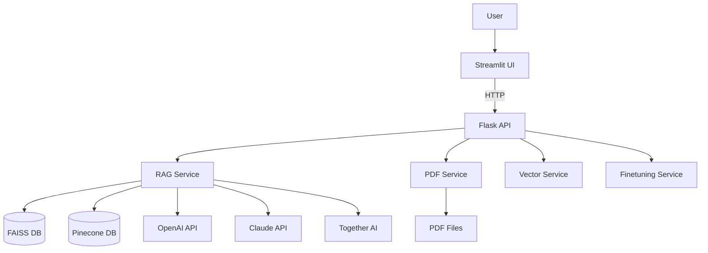

# 🤖 Multimodal RAG Application for Financial Analysis

A production-ready, multimodal Retrieval Augmented Generation (RAG) application designed for analyzing financial documents, specifically focused on Ceylon Tea Brokers PLC annual reports. The application processes text, tables, and images from PDFs to provide intelligent financial insights.

## 🌟 Features

- **Multimodal Document Processing**: Extracts and analyzes text, tables, and images from PDF documents
- **Multiple LLM Support**: 
  - OpenAI (GPT-4, GPT-3.5-turbo)
  - Anthropic (Claude-2)
  - Together AI (Mistral, Llama-2, Gemma)
  - Custom fine-tuned models
- **Dual Vector Database Support**: FAISS (local) and Pinecone (cloud)
- **Chat with PDFs**: On-the-fly PDF processing and question answering
- **Data Ingestion**: Support for PDFs, CSVs, and web scraping
- **Model Fine-tuning**: Fine-tune GPT-3.5-turbo on custom datasets
- **RAG Evaluation**: Built-in evaluation using RAGAS metrics
- **Report Generation**: Automated financial report creation in DOCX and PDF formats
- **REST API**: Complete Flask-based API for all functionalities
- **Modern UI**: Streamlit-based user interface
- **Docker Deployment**: Production-ready containerization

## 📦 Requirements

The project uses two separate requirements files:
- `backend/requirements.txt` - Backend Flask API dependencies
- `streamlit_requirements.txt` - Streamlit UI dependencies

## 📁 Project Structure

```
hackathon/
├── backend/                    # Backend Flask API
│   ├── api/                   # API routes
│   ├── services/              # Business logic services
│   ├── core/                  # Core configuration and logging
│   ├── models/                # Data models
│   ├── utils/                 # Utility functions
│   ├── main.py               # Application entry point
│   └── requirements.txt       # Backend dependencies
│
├── streamlit_app.py           # Streamlit UI application
├── streamlit_requirements.txt # Streamlit dependencies
│
├── docker/                    # Docker configuration
│   ├── backend.Dockerfile    # Backend container
│   ├── streamlit.Dockerfile  # Streamlit container
│   └── docker-compose.yml    # Orchestration
│
├── docs/                      # Documentation
│   ├── API.md                # API reference
│   └── DEPLOYMENT.md         # Deployment guide
│
├── data/                      # Data files and PDFs (not in repo)
├── vector_stores/            # Vector database indexes (not in repo)
├── outputs/                   # Generated outputs (not in repo)
│
├── .env.example              # Environment variables template
├── .gitignore               # Git ignore rules
└── README.md                # This file
```

## 🚀 Quick Start

### Prerequisites

- Python 3.10+
- Docker and Docker Compose (for containerized deployment)
- OpenAI API key (required)
- Anthropic API key (optional, for Claude)
- Together AI API key (optional, for open-source models)
- Pinecone API key (optional, for cloud vector database)

### Local Development Setup

1. **Clone the repository**
   ```bash
   cd /path/to/hackathon
   ```

2. **Create environment file**
   ```bash
   cp .env.example .env
   ```
   Edit `.env` and add your API keys.

3. **Install backend dependencies**
   ```bash
   cd backend
   pip install -r requirements.txt
   ```

4. **Install Streamlit dependencies**
   ```bash
   cd ..
   pip install -r streamlit_requirements.txt
   ```

5. **Run the backend**
   ```bash
   cd backend
   python main.py
   ```
   Backend will be available at `http://localhost:5000`

6. **Run Streamlit** (in a new terminal)
   ```bash
   streamlit run streamlit_app.py
   ```
   Streamlit UI will be available at `http://localhost:8501`

### Docker Deployment

1. **Setup environment**
   ```bash
   cp .env.example .env
   # Edit .env with your API keys
   ```

2. **Build and run with Docker Compose**
   ```bash
   cd docker
   docker-compose up --build
   ```

3. **Access the application**
   - Streamlit UI: http://localhost:8501
   - Backend API: http://localhost:5000

## 🔧 Configuration

All configuration is managed through environment variables. See `.env.example` for available options:

### Required Variables
- `OPENAI_API_KEY`: Your OpenAI API key

### Optional Variables
- `ANTHROPIC_API_KEY`: For Claude models
- `TOGETHER_API_KEY`: For open-source models
- `PINECONE_API_KEY`: For Pinecone vector database
- `FLASK_ENV`: Development or production mode
- `LOG_LEVEL`: Logging verbosity (INFO, DEBUG, WARNING, ERROR)

## 📖 Usage

### Chat with PDFs
1. Navigate to "Chat with PDFs" tab
2. Upload a PDF or use the existing index
3. Ask questions about the document
4. View answers with relevant images

### Inject Documents to Vector Database
1. Go to "Inject to Vector DB" tab
2. Choose between file upload or URL
3. Select vector database (FAISS or Pinecone)
4. Click "Inject Data"

### RAG Question Answering
1. Select "RAG Application" tab
2. Choose your model and database
3. Ask your question
4. View answer with context and related URLs

### Fine-tuning
1. Go to "Fine-tuning" tab
2. Upload a CSV with Question and Answer columns
3. Provide a model suffix name
4. Enter your OpenAI API key
5. Start fine-tuning (takes ~5 minutes)

### Report Generation
1. Use the RAG application to generate insights
2. Go to "Report Generation" tab
3. Select number of responses to include
4. Generate and download DOCX/PDF report

## 🏗️ Architecture



## 🔌 API Endpoints

### Core Endpoints
- `GET /api/hello` - Health check
- `POST /api/answer_question` - RAG question answering
- `POST /api/chat_with_pdfs` - Chat with uploaded PDFs
- `POST /api/inject_to_vector_db` - Inject documents to vector DB
- `POST /api/finetune` - Fine-tune a model
- `POST /api/evaluation` - Evaluate RAG performance
- `POST /api/report_generation` - Generate reports

### Feedback & Reports
- `POST /api/submit_feedback` - Submit user feedback
- `POST /api/submit_report` - Save report data
- `GET /api/download_docx/<filename>` - Download DOCX report
- `GET /api/download_pdf/<filename>` - Download PDF report

See `docs/API.md` for detailed API documentation.

## 🧪 Testing

The application includes built-in evaluation using RAGAS metrics:
- Faithfulness
- Answer Relevancy
- Context Recall
- Context Precision
- Answer Correctness

To run evaluation:
1. Prepare a test CSV with `question` and `ground_truth` columns
2. Use the evaluation endpoint or UI tab
3. View detailed metrics

## 🛠️ Development

### Project Components

**Backend Services:**
- `rag_service.py` - RAG question answering logic
- `pdf_service.py` - PDF processing and vectorization
- `vector_service.py` - Vector database management
- `finetuning_service.py` - Model fine-tuning
- `evaluation_service.py` - RAG evaluation
- `report_service.py` - Report generation
- `data_ingestion_service.py` - CSV and URL ingestion

**Core:**
- `config.py` - Configuration management
- `logger.py` - Logging setup

### Adding New Features

1. Create service in `backend/services/`
2. Add routes in `backend/api/routes.py`
3. Update frontend in `frontend/streamlit_app.py`
4. Update documentation

## 📊 Data Flow

1. **Document Ingestion**: PDF → Unstructured Parser → Text/Tables/Images
2. **Summarization**: Content → GPT-4/GPT-4-Vision → Summaries
3. **Embedding**: Summaries → OpenAI Ada-002 → Vectors
4. **Storage**: Vectors → FAISS/Pinecone
5. **Retrieval**: Question → Similarity Search → Context
6. **Generation**: Context + Question → LLM → Answer

## 🔒 Security

- All API keys stored in environment variables
- No hardcoded credentials
- CORS configuration for API access
- File upload validation
- Sandboxed execution where applicable

## 🐛 Troubleshooting

**Backend won't start:**
- Check `.env` file has required API keys
- Verify Python version is 3.10+
- Check logs in `logs/app.log`

**Frontend can't connect to backend:**
- Ensure backend is running on port 5000
- Check `BACKEND_API_URL` environment variable
- Verify CORS settings

**Vector database errors:**
- Ensure vector stores directory exists
- Check file permissions
- Rebuild indexes if corrupted

**Docker issues:**
- Ensure Docker and Docker Compose are installed
- Check port availability (5000, 8501)
- View logs: `docker-compose logs`

## 📝 License

This project was created for a hackathon and is provided as-is.

## 🤝 Contributing

This is a hackathon project that has been refactored for production use. Contributions are welcome!

## 📧 Contact

For questions or issues, please open an issue in the repository.

---


